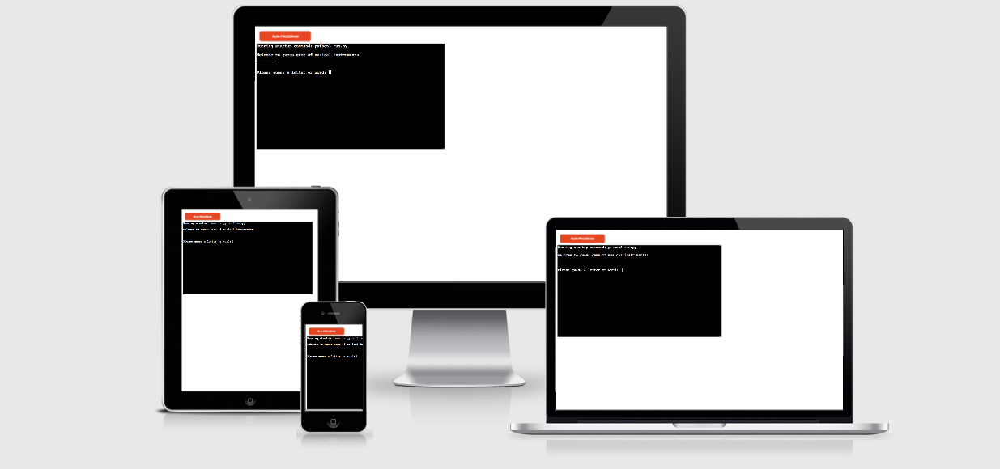
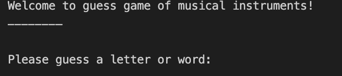
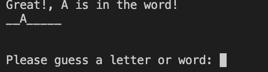
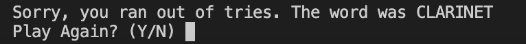
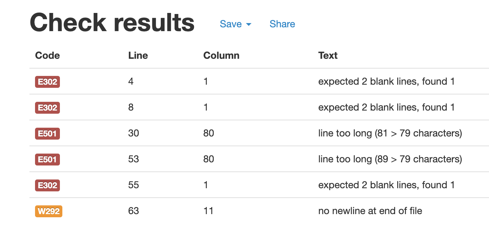

# Can you guess?

Can you guess is a fun online guess game where users can test their knowledge in musical instruments. There are possibilities of older and more classical instruments as well as new and modern musical instruments. The user can guess a musical instrument by it's length of words and in limited guess possibilities. 

# Table of Contents 
* [UX]("UX")
    * [User Goals](#user-goals "User Goals")
    * [User Stories](#user-stories "User Stories")
    * [Features](#features "Features") 
    * [Features to be implemented](#features-to-be-implemented "Features to be implemented") 
    * [Technologies used](#technologies-used)
    * [Testing](#testing)
    * [Unfixed Bugs](#unfixed-bugs)
    * [Deployment](#deployment)
    * [Credits](#credits)
# How to play
When users run the program, they are asked to guees a letter or a word in a list of secret musical instruments. They start the game when typing the letter into input. They confirm the input by pressing "Enter". If they guessed the right letter, the program lets them know that the guessed the right letter. IF the user make wrong guess, the program lets them know that they did not guess the right letter and their lives are decreased by one. The total lives the user have is six. After all lives are used, the game ends and the user is asked if they want to play again. They can do that by entering Y letter into input terminal. If the user guess the right word within the six lives they have, then they win the game!
# UX

## User Goals 
- Easy to use
- Clear instructions provided
- Contains only musical instruments

## User Stories
- As a user, I want game to be easy to use
- As a user, I want game to include only musical instruments
- As a user, I want to restart the game at the end

# Features 
- The user gets welcome message and instructions before game starts 
### 
- The user can play a game using input field and send letter they think are part of the word
- The user gets feedback on whenever they guessed the right word or not
### 
- The user gets displayed the remaining lives or tries they have left in the game
- At the end, the user can have option on playing a game from the beginning
### 
## Features to be implemented 
- The user could have displayed the visual part of the game
- The user could have options on selecting the game to be in categories of easy - medium - hard
## Technologies Used
### Main Languages Used
- [Python](https://en.wikipedia.org/wiki/Python_(programming_language) "Link to Python Wiki")

## Tools
* [Gitpod](https://www.gitpod.io/ "Gitpod")
* [Pep8Online](https://pep8online.com/ "pep8online")
* [Responsive Design](http://ami.responsivedesign.is/ "Am I Responsive")
* [Heroku](https://www.heroku.com "Heroku")

# Testing
### Code Validation
The [PEP8 Online Checker](https://pep8online.com/) service was used to validate the code written in the word_list.py and run.py files.

### Results 

## Manual Testing
### Common Elements Testing
Manual testing was conducted on the following elements that appear in the program:

Word List - was checked that contains only musical instruments

Input by the user - was checked that user can send only letters and the lenght is not greater than the word

Right Guess - was checked that when user submit the right guess, the print statement let them know that they guessed the right letter or word. The right letter is the displayed in the secred word.

Wrong Guess - was checked that when user submti the wrong guess, the print statement let them know that they submitted the wrong guess. After wrong guess, the user lives are decrement by one.

Win Game - was checked when user guess the right word, the program lets them know that they win the game and prints win statement. 

End Game - was checked when user lost all of the lives that the game stops.

Play Again - was check at the end of the game that users can play the game again if they wish. 

# Deployment
The project was deployed using Code Institutes mock terminal for Heroku. 

* Steps to deploy:
  * Fork or clone this repository.
  * Create a new app in [Heroku](https://dashboard.heroku.com/apps).
  * Select "New" and "Create new app".
  * Name the new app and click "Create new app".
  * In "Settings" select "BuildPack" and select Python and Node.js. (Python must be at the top of the list).
  * Whilst still in "Settings", click "Reveal Config Vars" and input the folloing. KEY: PORT, VALUE: 8000. Nothing else is needed here as this project does not have any sensitive files.
  * Click on "Deploy" and select your deploy method and repository.
  * Click "Connect" on selected repository. 
  * Either choose "Enable Automatic Deploys" or "Deploy Branch" in the manual deploy section. 
  * Heroku will now deploy the site.

# Acknowledgements

Can You Guess? was designed, created and developed in conjunction with the Full Stack Software Developer Diploma course at the Code Institute. I would like to thank my mentor, tutors, Slack community and Code Institute for all their support.

[Back to top](<#contents>)